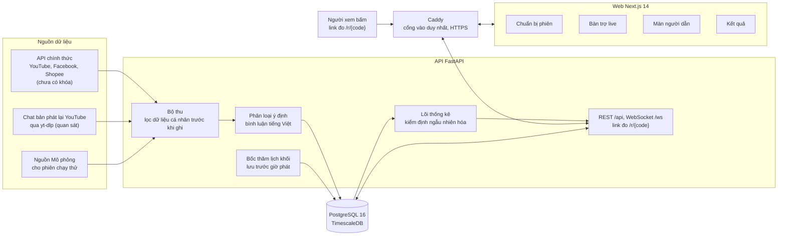

<div align="center">

# LiveLift

**Nền tảng thí nghiệm vận hành và hỗ trợ ra quyết định cho livestream thương mại**

Đo xem một quyết định trong phiên live, như ghim sản phẩm, có thật sự làm khách bấm nhiều hơn hay chỉ trùng thời điểm.

[](LICENSE)
[](pyproject.toml)
[](web/package.json)
[](#kiểm-thử-và-chất-lượng)
[](https://github.com/astral-sh/ruff)

[Bắt đầu nhanh](#bắt-đầu-nhanh) · [Trạng thái dự án](#trạng-thái-dự-án) · [Kiến trúc](#kiến-trúc) · [Hướng dẫn sử dụng](docs/HUONG-DAN-SU-DUNG.md) · [Tài liệu](#tài-liệu) · [English summary](#english-summary)

</div>

> [!NOTE]
> **Tình trạng ngày 27/09/2026.** Hệ thống chạy được trọn một phiên trên dữ liệu mô phỏng và phiên chạy thử. Chưa có phiên thí nghiệm ngẫu nhiên thật nào, và chưa có khóa API nền tảng chính thức nào đang chạy. Chi tiết ở mục [Trạng thái dự án](#trạng-thái-dự-án).


*Bàn trợ live trong một phiên chạy thử. Bình luận đến từ nguồn Mô phỏng, không phải khách thật. Ảnh chụp tự động ngày 25/09/2026 bằng `scripts/chup_giao_dien.py`.*

## Mục lục

- [LiveLift là gì](#livelift-là-gì)
- [Tính năng chính](#tính-năng-chính)
- [Trạng thái dự án](#trạng-thái-dự-án)
- [Kiến trúc](#kiến-trúc)
- [Bắt đầu nhanh](#bắt-đầu-nhanh)
- [Cấu hình](#cấu-hình)
- [Kiểm thử và chất lượng](#kiểm-thử-và-chất-lượng)
- [Cấu trúc thư mục](#cấu-trúc-thư-mục)
- [Tài liệu](#tài-liệu)
- [Bảo mật và quyền riêng tư](#bảo-mật-và-quyền-riêng-tư)
- [Đóng góp](#đóng-góp)
- [Đội ngũ và cuộc thi](#đội-ngũ-và-cuộc-thi)
- [Trích dẫn và giấy phép](#trích-dẫn-và-giấy-phép)
- [English summary](#english-summary)

## LiveLift là gì

### Vấn đề

Phút 30, người trợ live ghim sản phẩm B. Phút 35, lượt bấm vào B tăng. Có thể do lệnh ghim. Cũng có thể nền tảng vừa đẩy thêm người xem vào phòng, hoặc người dẫn vừa kể một câu chuyện hay. Số liệu sau phiên không tách được ba khả năng này, nên phần lớn quyết định trong phiên live vẫn dựa vào kinh nghiệm.

A/B test thông thường chia người dùng thành hai nhóm. Trong livestream, cả phòng nhìn cùng một màn hình nên không chia được người. Thứ chia được là thời gian.

### Cách LiveLift giải

LiveLift dùng thiết kế luân phiên theo thời gian, gọi là switchback:

1. **Chia phiên thành khối.** Phiên 90 phút có 16 khối. Khối đầu và khối cuối dài khoảng 10 phút, 14 khối giữa dài khoảng 5 phút.
2. **Bốc thăm trước giờ phát.** Mỗi khối được gán BẬT (áp dụng quyết định, ví dụ ghim sản phẩm) hoặc TẮT (vận hành như thường lệ). Lịch và mã băm của thiết kế được lưu trước khi lên sóng. Phiên chưa có lịch thì không bắt đầu phát được.
3. **So sánh sau phiên.** Chỉ số chính là lượt nhấp hợp lệ trên 1.000 giây xem, đo qua link chuyển hướng `/r/{code}`. 60 giây đầu mỗi khối bị bỏ khi phân tích. Hệ thống so nhóm khối BẬT với nhóm khối TẮT, rồi báo chênh lệch kèm khoảng tin cậy 95% từ kiểm định ngẫu nhiên hóa.


*Lịch khối của một phiên 90 phút, sinh bằng chính hàm gán của sản phẩm (seed 42). Vẽ lại bằng `python scripts/ve_hinh_ho_so.py`.*

Phương pháp chi tiết (tầng khám phá bên trong khối BẬT, quy tắc lượt nhấp hợp lệ, ước lượng viên, quy tắc dừng và loại trừ khối) được khóa trước trong [PREREGISTRATION.md](PREREGISTRATION.md). Nền tảng lý thuyết chính: Bojinov, Simchi-Levi và Zhao (2023) về thiết kế switchback tối ưu; Hu và Wager (2022) về hiệu ứng lưu; Bojinov và Shephard (2019) về kiểm định ngẫu nhiên hóa.

### Dành cho ai

- **Nhà bán và đội vận hành livestream** muốn biết thao tác nào thật sự đáng giữ.
- **Người trợ live** dùng Bàn trợ live trong lúc phát: xem khối hiện tại, thực hiện lệnh ghim, theo dõi bình luận đã lọc.
- **Người dẫn** xem một màn hình riêng chỉ có thời gian, sản phẩm đang ghim, giá và tồn kho.
- **Người làm nghiên cứu** cần một bộ công cụ mở cho thiết kế switchback, có mô phỏng và kiểm định đi kèm.

## Tính năng chính

| Tính năng | Làm gì | Trạng thái |
|---|---|---|
| Chuẩn bị phiên (`/chay-phien`) | Bốn bước: khai báo sản phẩm và link, tạo phiên, bốc thăm lịch BẬT/TẮT, kiểm tra rồi lên sóng | Chạy được |
| Bàn trợ live (`/desk`) | Khối hiện tại, đồng hồ chuyển khối, tín hiệu phiên, bình luận đã lọc, gợi ý hành động. Hai chế độ: Chỉ gợi ý và Tự ghim (nút Gợi ý và Tự động trên thanh trạng thái) | Chạy được trên phiên chạy thử |
| Màn người dẫn (`/host`) | Chỉ nhận bốn trường: thời gian đã phát, sản phẩm đang ghim, giá, tồn kho. Không có lịch, khối hay nhánh | Chạy được. Làm mù người dẫn chỉ ở mức một phần, xem ghi chú bên dưới |
| Link đo lượt nhấp (`/r/{code}`) | Chuyển người xem tới trang sản phẩm và ghi lượt nhấp. Năm quy tắc hợp lệ gắn cờ lượt nhấp đáng ngờ, không xóa | Chạy được. Live thật cần tên miền công khai |
| Kết quả (`/ket-qua`) và báo cáo phiên | Ước lượng tác động, khoảng tin cậy 95%, giá trị p, MDE. Từ chối trả số khi chưa đủ khối đo | Chạy được trên dữ liệu mẫu |
| Lọc dữ liệu cá nhân tiếng Việt | Che số điện thoại (kể cả số viết bằng chữ), email, mã đơn, địa chỉ, tên người, số tài khoản, tài khoản mạng xã hội trước khi ghi | Chạy được |
| Phân loại ý định bình luận | Gắn nhãn hỏi giá, hỏi size, chốt đơn và các ý định khác cho radar trên Bàn trợ live | v1 mặc định. v2 đang thử nghiệm |
| Xem lại phiên (`/replay`) | Phát lại một phiên hoặc một buổi YouTube đã kết thúc, tua theo thời gian, xem radar ý định | Chạy được. Chỉ phân tích quan sát. Buổi YouTube được tải chat bằng yt-dlp, không qua API chính thức |
| Bộ nối nền tảng chính thức | YouTube Data API, Facebook Graph API, Shopee Open Platform, TikTok Shop (số liệu theo phút sau phiên) | Có mã và kiểm thử. Chưa gọi thật lần nào |
| Nhập đơn hàng | Nhập tệp CSV đơn hàng xuất từ Seller Center vào báo cáo phiên | Chạy được. Đơn hàng là chỉ số phụ |

**Ghi chú về màn người dẫn.** Màn này che lịch khối, nhưng người dẫn vẫn thấy sản phẩm đang ghim, và ở chế độ Tự ghim lệnh ghim chỉ đến trong khối BẬT. Vì vậy việc làm mù người dẫn chỉ đạt một phần. Phép so của LiveLift là chiến lược ghim với cách làm thường lệ, đã tính cả phản ứng của người dẫn.

## Trạng thái dự án

| Mức | Nội dung |
|---|---|
| **Đã chạy được** | Trọn vòng một phiên: chuẩn bị, bốc thăm, phát, ghim, kết thúc, đọc kết quả. Chạy bằng Docker hoặc chạy local. Đã kiểm trên phiên chạy thử với nguồn bình luận Mô phỏng và trên bộ Demo Vàng (6 phiên mô phỏng phủ ba trong bốn trạng thái kết luận: dương, chưa phát hiện tác động, chưa đủ điều kiện). |
| **Đang thử nghiệm** | Bộ phân loại ý định v2, bật bằng `LIVELIFT_INTENT_MODEL=v2`, chưa là mặc định. Chế độ Tự ghim: hệ thống ra lệnh ghim trong khối BẬT, người trợ live vẫn thao tác ghim trên ứng dụng của nền tảng, và API phải chạy một tiến trình. Bộ nối API chính thức của YouTube, Facebook, Shopee và TikTok Shop. |
| **Chưa có** | Phiên thí nghiệm ngẫu nhiên thật: 0. Khóa API nền tảng đang chạy: 0. Nhà bán ngoài nhóm dùng thử: 0. Nhãn do người gán cho tập đánh giá NLP. Đăng nhập và phân quyền người dùng. Mẫu thỏa thuận xử lý dữ liệu với nhà bán. |

### Bộ số chuẩn

Mọi con số dưới đây lấy từ [docs/competition/FACT-SHEET.md](docs/competition/FACT-SHEET.md). Số kiểm thử, hiệu chuẩn và MDE sinh lại được bằng lệnh trong kho. Số NLP và số bình luận quan sát cần dữ liệu nằm ngoài git theo chính sách dữ liệu cá nhân, nên người ngoài nhóm chỉ đọc được kết quả đã ghi, không chạy lại được. Số nào lệch nguồn thì `tests/test_so_cong_bo.py` báo đỏ.

| Chỉ số | Giá trị | Nguồn và cách kiểm |
|---|---|---|
| Kiểm thử tự động | 2.116 test thu thập được, gồm 2.089 nhanh, 17 chậm và 10 trên trình duyệt. Lần chạy đầy đủ gần nhất (27/09/2026, trên nhánh hoàn thiện trước khi hợp nhất vào `main`): 2.114 đạt, 2 bỏ qua có lý do, 0 lỗi | `scripts/dong_bo_so_test.py --xem-truoc` |
| Hiệu chuẩn A/A (mô phỏng) | Trên 200 lần chạy mô phỏng không có tác động, hệ thống báo nhầm 3,50% số lần (7/200), dưới mức cho phép 5%. p nhị thức 0,4168. Đo lại ngày 25/09/2026 tại commit `17c3ee1` | [so-hieu-chuan.json](docs/benchmarks/so-hieu-chuan.json), kiểm bằng `scripts/do_lai_so_hieu_chuan.py --kiem` |
| Thu hồi tác động biết trước (mô phỏng) | Trên 40 lần chạy mô phỏng có tác động gài sẵn, độ lệch tương đối của ước lượng là −0,84%. Khoảng tin cậy 95% chứa giá trị thật 37/40 lần (92,50%) | [so-hieu-chuan.json](docs/benchmarks/so-hieu-chuan.json) |
| Phân loại ý định trên chat thật | Trên 393 bình luận thật, macro-F1 tăng từ 0,211 [0,172; 0,247] của v1 lên 0,542 [0,478; 0,625] của v2 ở thang 11 lớp. Chấm cùng thang 6 lớp cũ: từ 0,370 lên 0,572. Nhãn tham chiếu do tác tử AI gán, chưa có nhãn người. Đánh giá chéo trên 320 câu mẫu do AI soạn cho 0,870, con số đó không đại diện cho chat thật | [intent-eval/results.md](docs/benchmarks/intent-eval/results.md), lệnh `python -m livelift.nlp.eval_intent --ablation --coverage` (cần tệp nhãn nằm ngoài git) |
| Bình luận quan sát | 19.126 bình luận từ 16 buổi phát lại YouTube công khai, 7 ngành hàng (lô đo 10/09/2026). Tải bằng yt-dlp, không qua API chính thức, chưa có sự đồng ý của người bình luận. Chỉ phân tích quan sát, không can thiệp. Đã dừng thu từ 17/09/2026 | [live-fire-da-nguon.md](docs/benchmarks/live-fire-da-nguon.md) |
| Lọc dữ liệu cá nhân | Bắt tối thiểu 95% ở sáu loại và 70% với tên người, trên 95 câu dữ liệu giả do Claude soạn | `tests/test_pii_filter.py` |
| Sổ sự cố | 121 sự cố, mỗi sự cố có phân tích nguyên nhân gốc | [docs/incident-log.md](docs/incident-log.md) |
| MDE lượt nhấp (mô phỏng) | 16,4% ở khoảng 59 người xem đồng thời, lực 80%. Nhóm ước tính trên giấy, chưa đo, rằng 300.000 đồng quảng cáo chỉ kéo được 5 đến 15 người xem đồng thời. Phòng nhỏ như vậy cần tác động lớn hơn nhiều mới phát hiện được | [tom-tat.json](docs/competition/sang-tao-tre-2026/hinh/du-lieu/tom-tat.json), lệnh `python scripts/ve_hinh_ho_so.py` |
| Phiên thí nghiệm ngẫu nhiên thật | 0 | FACT-SHEET, kiểm lại 25/09/2026 |
| Khóa API nền tảng chính thức đang chạy | 0 | [docs/HUONG-DAN-LAY-KHOA-API.md](docs/HUONG-DAN-LAY-KHOA-API.md) |

## Kiến trúc



- **Caddy** là cổng vào công khai duy nhất (cổng 80 và 443). `/api/*` (bỏ tiền tố `/api` trước khi chuyển tiếp), `/ws/*`, `/r/*`, `/docs` và `/openapi.json` đi tới API, mọi đường còn lại đi tới web. Đặt `DOMAIN` là tên miền thật thì Caddy tự xin chứng chỉ HTTPS. Cấu hình ở [docker/Caddyfile](docker/Caddyfile).
- **Bộ thu** chạy trong tiến trình API. Mỗi bình luận đi qua bộ lọc dữ liệu cá nhân trước khi gửi đi hay ghi nhật ký, và API lọc lần hai rồi mới gắn nhãn ý định và ghi kho. Kho không có trường nào cho bình luận thô.
- **Lịch khối** được sinh bằng seed cố định và lưu trước giờ phát. Bảng sự kiện gán và sự kiện hiển thị chỉ được ghi thêm, không có hàm sửa hay xóa.
- **Lõi thống kê** (`core`, `analysis`) là mã Python thuần, được thẩm định trên bộ mô phỏng hiệu chỉnh theo dữ liệu KuaiLive (`sim`).
- **Kho dữ liệu** là PostgreSQL với TimescaleDB khi chạy bằng Docker. Chạy local không có PostgreSQL thì API dùng kho bộ nhớ, ghi ảnh chụp 30 giây một lần. Tiến trình chết đột ngột thì mất tối đa khoảng 30 giây dữ liệu cuối. Xem [docs/luu-tru-du-lieu.md](docs/luu-tru-du-lieu.md).
- **Bộ thu TikTok không chính thức** (`collectors/tiktok_public`) nằm tách khỏi lõi. `scripts/check_isolation.py` chặn mọi import từ `src/` sang đó.

| Thành phần | Công nghệ |
|---|---|
| Lõi thống kê và mô phỏng | Python 3.11, NumPy, pandas, SciPy |
| API | FastAPI, Uvicorn, Pydantic 2, WebSocket |
| NLP | scikit-learn 1.9.0 (TF-IDF và hồi quy logistic), chạy trên CPU, không cần torch |
| Lưu trữ | PostgreSQL 16 với TimescaleDB, psycopg 3. Kho bộ nhớ có ảnh chụp cho chạy local |
| Web | Next.js 14, React 18, TypeScript, Tailwind CSS, Recharts |
| Hạ tầng | Docker Compose, Caddy 2, dịch vụ sao lưu `pg_dump` hằng ngày giữ 14 ngày. Redis 7 có sẵn trong ngăn xếp nhưng mã hiện tại chưa dùng |
| Chất lượng | pytest, Playwright, Ruff, mypy |

## Bắt đầu nhanh

### Yêu cầu

- Cách 1: Docker Desktop, hoặc Docker Engine có Compose v2. Cổng 80 và 443 phải trống. Cổng 5432 (PostgreSQL) và 6379 (Redis) chỉ mở trên 127.0.0.1 nhưng cũng phải trống, nên hãy tắt PostgreSQL cài sẵn trên máy nếu có.
- Cách 2: Python 3.11 trở lên, Node.js 20 trở lên (ảnh Docker và CI dùng Node 20) và npm. Cổng 3000 và 8000 phải trống.

### Cách 1: Docker (khuyến nghị)

```bash
git clone https://github.com/bminhnemhoi/AISC2026_LIVEFIT.git
cd AISC2026_LIVEFIT
cp .env.example .env
```

Trên Windows PowerShell, thay `cp` bằng `Copy-Item .env.example .env`.

**Mở `.env` và đổi `POSTGRES_PASSWORD`.** Tệp mẫu để sẵn một mật khẩu giữ chỗ. Docker Compose dừng ngay nếu biến này trống. Sau đó:

```bash
docker compose up -d
```

Lần đầu Docker dựng ảnh cho API và web nên mất vài phút. Kiểm tra hệ thống đã lên và đang dùng kho bền vững:

```bash
curl http://localhost/api/health
```

Trong JSON trả về, `storage_mode` phải là `postgres` và `durable` phải là `true`. Nếu nhận trang "Dịch vụ đang khởi động lại", API chưa lên xong (còn chạy migration hoặc đang khởi động): đợi khoảng một phút rồi gọi lại. Trên Windows PowerShell, gõ `curl.exe` thay cho `curl`.

Mở <http://localhost>. Dừng hệ thống bằng `docker compose down`, dữ liệu vẫn nằm trong volume.

### Cách 2: Chạy local không Docker

Windows PowerShell (mỗi lệnh một dòng, vì PowerShell 5.1 không hiểu `&&`):

```powershell
git clone https://github.com/bminhnemhoi/AISC2026_LIVEFIT.git
cd AISC2026_LIVEFIT
python -m venv .venv
.venv\Scripts\python -m pip install -e ".[dev,server,ml]"
cd web
npm ci
cd ..
.venv\Scripts\python scripts\chay_local.py
```

Linux hoặc macOS:

```bash
git clone https://github.com/bminhnemhoi/AISC2026_LIVEFIT.git
cd AISC2026_LIVEFIT
python3 -m venv .venv
source .venv/bin/activate
pip install -e ".[dev,server,ml]"
(cd web && npm ci)
python scripts/chay_local.py
```

`scripts/chay_local.py` báo tiến trình đang giữ cổng, dọn thư mục build cũ, dùng PostgreSQL nếu đang chạy (không có thì dùng kho bộ nhớ và nói rõ điều đó), bật API ở cổng 8000, bật web ở cổng 3000, rồi kiểm tra trang chủ và tệp CSS tải được. Mở <http://localhost:3000>. Nhấn Ctrl+C để dừng cả hai tiến trình.

Muốn kho bền vững khi chạy local, chạy `python scripts/bat_postgres.py` trước (cần Docker cho riêng cơ sở dữ liệu). Có GNU make (Git Bash, WSL, Linux, macOS) thì dùng được các lệnh tắt trong [Makefile](Makefile) như `make up`, `make test-fast`, `make lint`, `make chay-local`.

### Gieo dữ liệu mẫu

Cách nhanh nhất là bấm **Bắt đầu xem thử** trên trang chủ. Hệ thống tạo vài phiên mô phỏng có nhãn dữ liệu mẫu và mở màn Xem lại phiên.

Màn Kết quả xếp mỗi phiên vào một trong bốn trạng thái: dương, âm, chưa phát hiện tác động, chưa đủ điều kiện. Muốn xem ngay ba trạng thái hay gặp (dương, chưa phát hiện tác động, chưa đủ điều kiện), gieo bộ Demo Vàng gồm 6 phiên mô phỏng:

```bash
curl -X POST http://localhost/api/demo/seed-vang        # Docker
curl -X POST http://127.0.0.1:8000/demo/seed-vang       # chạy local
```

Gọi lại lần hai không sinh thêm bản sao. Mọi phiên mẫu mang cờ `is_demo` từ lúc sinh và không bao giờ lọt vào kết quả thật. Xem [docs/demo-vang.md](docs/demo-vang.md).

### Các trang chính

Với Docker, gốc địa chỉ là `http://localhost`. Chạy local, web ở `http://localhost:3000` và API ở `http://127.0.0.1:8000`.

| Đường dẫn | Trang |
|---|---|
| `/` | Trang chủ: ba lối vào, nút Bắt đầu xem thử, chip cho biết kho đang chứa dữ liệu mẫu hay thật |
| `/bat-dau` | Ba câu hỏi để biết làm được gì ngay với kênh của bạn và còn thiếu khóa gì |
| `/chay-phien` | Chuẩn bị phiên: bốn bước từ khai báo sản phẩm tới lên sóng |
| `/desk` | Bàn trợ live, dùng trong lúc phát |
| `/host?session=<mã phiên>` | Màn người dẫn, mở bằng nút ở bước 4 của Chuẩn bị phiên |
| `/replay` | Xem lại phiên |
| `/ket-qua` | Kết quả và chiến lược |
| `/bao-cao/<mã phiên>` | Báo cáo sau phiên cho nhà bán, mở từ Bàn trợ live, Xem lại phiên hoặc Kết quả |
| `/docs` (trên API) | Tài liệu OpenAPI, thử gọi trực tiếp |

Hướng dẫn bấm từng nút, có ảnh chụp từng bước: [docs/HUONG-DAN-SU-DUNG.md](docs/HUONG-DAN-SU-DUNG.md).

### Đưa lên máy chủ có tên miền

Trỏ DNS của tên miền về máy chủ và mở cổng 80, 443. Đặt trong `.env`: `DOMAIN=<tên miền>`, `NEXT_PUBLIC_API_URL=https://<tên miền>/api`, `NEXT_PUBLIC_PUBLIC_API_BASE=https://<tên miền>`, `CORS_ORIGINS=https://<tên miền>` và một `INGEST_TOKEN` ngẫu nhiên. Biến `NEXT_PUBLIC_*` được nhúng lúc build, nên phải build lại web mỗi khi đổi. Máy chủ chạy liên tục nhiều ngày thì dùng thêm lớp phủ [docker-compose.prod.yml](docker-compose.prod.yml) (xoay vòng nhật ký, trần bộ nhớ):

```bash
docker compose -f docker-compose.yml -f docker-compose.prod.yml up -d --build
python scripts/kiem_tra_truoc_demo.py --goc https://<tên miền>
```

Lệnh thứ hai kiểm kho, CSS, sao lưu và dữ liệu mẫu trên hệ thống đang chạy. Chạy nó ngay trên máy chủ (phần sao lưu đọc thư mục `backups/` cục bộ) trước mỗi buổi trình diễn. Không có `--goc` thì script kiểm `127.0.0.1:8000` và `127.0.0.1:3000` của cách chạy local.

## Cấu hình

Các biến nằm trong [.env.example](.env.example), có chú thích từng dòng. Riêng `LIVELIFT_INTENT_MODEL` chưa có trong tệp mẫu, cần thì thêm tay. Không commit tệp `.env`.

| Biến | Mặc định | Ý nghĩa |
|---|---|---|
| `POSTGRES_PASSWORD` | (phải đặt) | Mật khẩu cơ sở dữ liệu. Bắt buộc với Docker |
| `STORE_BACKEND` | `memory` | `memory` hoặc `postgres`. Docker Compose luôn đặt `postgres`. Phiên live thật phải dùng `postgres` |
| `STORE_SNAPSHOT_ENABLED`, `STORE_SNAPSHOT_INTERVAL_S` | `true`, `30` | Ảnh chụp định kỳ của kho bộ nhớ |
| `DOMAIN` | trống | Để trống thì chạy ở `http://localhost`. Tên miền thật thì Caddy bật HTTPS |
| `NEXT_PUBLIC_API_URL` | `http://localhost/api` | Địa chỉ API mà trình duyệt gọi. Đổi xong phải build lại web |
| `NEXT_PUBLIC_PUBLIC_API_BASE` | trống | Địa chỉ công khai in trong link đo `/r/{code}` |
| `CORS_ORIGINS` | localhost:3000 | Nguồn được phép gọi API khi web và API ở hai tên miền khác nhau |
| `INGEST_TOKEN` | trống | Khóa bảo vệ mọi đường ghi. Để trống là tắt kiểm tra. Bắt buộc trước khi mở địa chỉ công khai |
| `PUBLIC_DEMO_WRITES` | `true` | Khi đã đặt token: khách không có token chỉ tạo và chạy được phiên mẫu của riêng mình |
| `RESULTS_FREEZE_UNTIL` | trống | Khóa các trường suy diễn trên trang Kết quả tới ngày này, theo tiền đăng ký |
| `LIVELIFT_AUTOPILOT` | `1` | Bật bộ thực thi Tự ghim. Chỉ để bật ở một tiến trình API |
| `LIVELIFT_INTENT_MODEL` | trống (v1) | Đặt `v2` để dùng bộ phân loại ý định đang thử nghiệm |
| `INGEST_YOUTUBE_BACKEND` | `api` | `api` dùng YouTube Data API. `ytdlp` không cần khóa nhưng trái điều khoản của YouTube, chỉ dùng cho kênh của nhóm hoặc kiểm thử |

Khóa nền tảng (`YOUTUBE_API_KEY`, `FACEBOOK_PAGE_*`, `SHOPEE_*`, `TIKTOK_SHOP_*`) để trống cho tới khi có. Cách lấy từng khóa: [docs/HUONG-DAN-LAY-KHOA-API.md](docs/HUONG-DAN-LAY-KHOA-API.md). Nền tảng nào đo được gì: [docs/nen-tang-ho-tro.md](docs/nen-tang-ho-tro.md).

## Kiểm thử và chất lượng

Các lệnh dưới đây giả định đã kích hoạt `.venv`. Trên Windows chưa kích hoạt thì gọi `.venv\Scripts\python -m pytest ...`.

```bash
pytest -m "not slow"               # 2089 test nhanh, khoảng 4 phút
pytest -m "slow and not browser"   # 17 cổng chậm (13 mô phỏng/thống kê · 1 đánh giá NLP · 3 cổng build CSS), khoảng 25 phút
pytest -m browser                  # 10 test trình duyệt, cần Node, npm ci trong web/ và Chromium của Playwright
ruff check src tests
ruff format --check src tests
python scripts/check_isolation.py              # collectors/ không được import vào lõi
python scripts/do_lai_so_hieu_chuan.py --kiem  # chạy lại mô phỏng A/A, đối chiếu so-hieu-chuan.json (10 đến 20 phút)
python scripts/dong_bo_so_test.py --xem-truoc  # đếm test bằng pytest, soát mọi nơi đang trích số test
```

Test trình duyệt cần Playwright: `pip install playwright` rồi `python -m playwright install chromium`. Máy thiếu Node hoặc Playwright thì các test này tự bỏ qua và báo lý do.

Quality gates: 2089 test nhanh phải xanh trước mỗi PR. Cổng chậm chạy trước mỗi lần phát hành hoặc khi đổi phần thống kê. Ngưỡng từng cổng (tỷ lệ bắt của bộ lọc dữ liệu cá nhân, cân bằng gán trên 1.000 lịch, độ lệch và độ phủ của ước lượng viên, cách ly `collectors/`, migration chạy lên rồi xuống) ghi trong [HARNESS.md](HARNESS.md).

Nguyên tắc làm việc:

- **Test trước, sửa sau.** Mỗi lỗi có một test tái hiện, được sửa tận gốc và ghi vào [sổ sự cố](docs/incident-log.md) kèm nguyên nhân gốc và commit.
- **Số công bố không chép tay.** Số test đồng bộ bằng `scripts/dong_bo_so_test.py`. Số hiệu chuẩn sinh bằng `scripts/do_lai_so_hieu_chuan.py`. Số NLP sinh bằng `python -m livelift.nlp.eval_intent`. Test so tài liệu với nguồn và báo đỏ khi lệch.
- **CI.** Cấu hình GitHub Actions nằm ở `.github/workflows/ci.yml`. Kiểm ngày 25/09/2026, GitHub Actions không chạy được job nào vì tài khoản bị khóa do vấn đề thanh toán, không phải do mã. Mọi con số kiểm thử trong README là kết quả chạy cục bộ bằng đúng các lệnh trên.

Hướng dẫn kiểm từng khả năng, kèm kết quả mong đợi: [docs/HUONG-DAN-TEST.md](docs/HUONG-DAN-TEST.md).

## Cấu trúc thư mục

```text
.
├── src/livelift/
│   ├── api/             # FastAPI: route REST, WebSocket, khóa đường ghi, bộ thực thi Tự ghim
│   ├── core/            # bốc thăm lịch khối (assigner/), gộp sự kiện theo khối, QC sau phiên, ma trận tín hiệu
│   ├── analysis/        # ước lượng viên, kiểm định ngẫu nhiên hóa, lực thống kê và MDE
│   ├── sim/             # mô phỏng hiệu chỉnh theo KuaiLive, thẩm định ước lượng viên
│   ├── ingest/          # bộ thu nền tảng, phát lại YouTube, nguồn Mô phỏng, pii/ (lọc dữ liệu cá nhân)
│   ├── nlp/             # phân loại ý định bình luận tiếng Việt và mô hình đã huấn luyện
│   ├── dbops/           # công cụ chạy migration
│   └── migrations/      # 9 bản migration SQL, mỗi bản có up và down
├── web/                 # giao diện Next.js 14
├── tests/               # pytest: nhanh, chậm, trình duyệt, hợp đồng web và API
├── scripts/             # khởi động local, đồng bộ số, đo lại hiệu chuẩn, vẽ hình hồ sơ, kiểm trước demo
├── collectors/          # bộ thu TikTok không chính thức, cách ly khỏi lõi
├── analysis/            # script hiệu chỉnh mô phỏng theo KuaiLive, bảng ICC và bảng MDE
├── ops/                 # quy trình vận hành phiên live, mẫu nhật ký, thư mời đối tác
├── docker/              # Dockerfile của API và web, Caddyfile, script sao lưu
├── docs/                # hướng dẫn, benchmark, nghiên cứu, sổ sự cố, hồ sơ dự thi
├── data/                # dữ liệu cục bộ, nằm ngoài git theo chính sách dữ liệu cá nhân
└── docker-compose.yml   # ngăn xếp chính; thêm lớp phủ .prod.yml và .dev-ports.yml
```

## Tài liệu

| Tài liệu | Nội dung |
|---|---|
| [docs/HUONG-DAN-SU-DUNG.md](docs/HUONG-DAN-SU-DUNG.md) | Hướng dẫn cho người dùng: bấm nút nào, ở đâu, chuyện gì xảy ra, có ảnh chụp từng bước |
| [docs/HUONG-DAN-TEST.md](docs/HUONG-DAN-TEST.md) | Kiểm thử từng khả năng, lệnh đã chạy thật và kết quả mong đợi |
| [docs/HUONG-DAN-LAY-KHOA-API.md](docs/HUONG-DAN-LAY-KHOA-API.md) | Lấy khóa YouTube, Facebook, Shopee, TikTok Shop |
| [docs/luu-tru-du-lieu.md](docs/luu-tru-du-lieu.md) | Các chế độ kho dữ liệu và cách bật PostgreSQL. Đọc trước khi live thật |
| [PREREGISTRATION.md](PREREGISTRATION.md) | Tiền đăng ký phân tích: câu hỏi, thiết kế, biến kết quả, ước lượng viên, quy tắc dừng |
| [HARNESS.md](HARNESS.md) | Quy trình phát triển và các cổng chất lượng |
| [docs/competition/FACT-SHEET.md](docs/competition/FACT-SHEET.md) | Bộ số chuẩn duy nhất của dự án, kèm nguồn từng số |
| [docs/incident-log.md](docs/incident-log.md) | Sổ sự cố: triệu chứng, nguyên nhân gốc, commit sửa, cổng chặn tái diễn |
| [docs/benchmarks/](docs/benchmarks/) | Kết quả đo sinh lại được: hiệu chuẩn, NLP, KuaiLive, bình luận quan sát |
| [docs/research/](docs/research/) | Báo cáo nghiên cứu: thiết kế switchback, ước lượng viên, NLP tiếng Việt, API nền tảng, thị trường |
| [docs/TONG-KET-DU-AN.md](docs/TONG-KET-DU-AN.md) | Tổng kết: đã đạt, còn thiếu, nợ kỹ thuật |
| [ops/runbooks/quy-trinh-phien.md](ops/runbooks/quy-trinh-phien.md) | Quy trình vận hành một phiên live thật |
| [docs/competition/sang-tao-tre-2026/noi-dung.md](docs/competition/sang-tao-tre-2026/noi-dung.md) | Nguồn hồ sơ dự án dự thi Sáng tạo trẻ Quốc gia về AI 2026 |
| [docs/competition/sang-tao-tre-2026/05-BAN-KE-KHAI.md](docs/competition/sang-tao-tre-2026/05-BAN-KE-KHAI.md) | Bản kê khai sử dụng AI trong dự án |

## Bảo mật và quyền riêng tư

- **Lọc trước khi ghi.** Bộ lọc dữ liệu cá nhân chạy trước mọi lệnh ghi và mọi dòng nhật ký. Ngoại lệ: khi tải bằng yt-dlp, tệp chat thô nằm trong thư mục tạm và bị xóa ngay sau khi đọc.
- **Không lưu định danh người bình luận**, kể cả dạng băm. Chống trùng bằng mã bình luận của nền tảng. Lượt nhấp chỉ lưu mã băm dấu vân tay thiết bị trộn với mã phiên và một chuỗi ngẫu nhiên, nên không nối được một người qua hai phiên.
- **Bí mật không vào git.** `.env` bị `.gitignore` chặn. Chỉ `.env.example`, không có giá trị thật, được commit.
- **Đường ghi có khóa.** Chưa có đăng nhập người dùng. Khi chưa đặt `INGEST_TOKEN`, chỉ chạy trên máy cá nhân hoặc mạng nội bộ.
- **Dữ liệu quan sát.** 19.126 bình luận của 16 buổi phát lại được tải bằng yt-dlp khi chưa có sự đồng ý của người bình luận. Nhóm không tự nhận có căn cứ pháp lý để xử lý tập này, không công bố nguyên văn, và đã dừng thu mới từ 17/09/2026. Tập này không nằm trong kho mã, trừ vài dòng chat đã thay danh tính và lọc, dùng làm dữ liệu kiểm thử, và vài câu ví dụ đã lọc trong `src/livelift/nlp/labels.py`. Nhóm cam kết xóa an toàn bản sao lưu còn định danh chậm nhất ngày 29/09/2026 (`scripts/xoa_ban_tho_16_buoi.py`), và xóa phần đã lọc còn giữ khi có tập thay thế qua API chính thức, chậm nhất ngày 22/11/2026. Chi tiết ở mục 3.3 của [hồ sơ dự án](docs/competition/sang-tao-tre-2026/noi-dung.md).
- **Lỗ hổng đã tự phát hiện.** Bộ lọc từng bỏ sót tên tài khoản YouTube có dấu và tên viết dính liền kiểu `@@tên` (vá ngày 25/09/2026, commit `b331076`). Một bản cũ của tệp mô hình ý định v2 có một từ sinh từ tên tài khoản. Tệp đã đóng gói lại, nhưng bản cũ vẫn còn trong lịch sử git của kho công khai. `tests/test_artifact_khong_pii.py` nay kiểm cả từ vựng của mô hình.
- **Căn cứ pháp lý tham chiếu:** Luật Bảo vệ dữ liệu cá nhân số 91/2025/QH15 và Nghị định 356/2025/NĐ-CP.

**Báo lỗ hổng bảo mật.** Đừng mở issue công khai kèm chi tiết khai thác. Kênh báo riêng của GitHub (private vulnerability reporting) chưa bật cho kho này (kiểm ngày 27/09/2026). Trong lúc chờ, hãy tạo một issue chỉ ghi "cần kênh báo lỗi bảo mật", không kèm chi tiết, trưởng nhóm sẽ liên hệ lại. Khi kênh đó được bật, báo cáo gửi qua [Security Advisories](https://github.com/bminhnemhoi/AISC2026_LIVEFIT/security/advisories/new) của kho.

## Đóng góp

Đọc [CONTRIBUTING.md](CONTRIBUTING.md) trước. Tệp đó có lộ trình 90 phút cho thành viên mới và checklist bắt buộc trước khi mở PR. Luật làm việc nằm trong [HARNESS.md](HARNESS.md).

Tóm tắt: tạo nhánh riêng, viết test trước, chạy `pytest -m "not slow"`, `ruff check` và `scripts/check_isolation.py` trước khi mở PR. Đổi phần thống kê thì chạy thêm cổng chậm. Sửa lỗi thì ghi một dòng vào sổ sự cố.

## Đội ngũ và cuộc thi

Nhóm sinh viên Trường Đại học Tôn Đức Thắng:

| Thành viên | Phạm vi phụ trách |
|---|---|
| Ngô Bình Minh (trưởng nhóm) | Lõi thống kê, API, tích hợp, hồ sơ |
| Lê Xuân Khánh | Tầng dữ liệu, NLP, bộ nối nền tảng |
| Ngô Lâm Tiến | Giao diện web, kiểm thử đầu cuối, minh chứng |

Phân công chi tiết: [09-PHAN-CONG.md](docs/competition/sang-tao-tre-2026/09-PHAN-CONG.md).

Dự án dự thi:

- **Cuộc thi Sáng tạo trẻ Quốc gia về AI 2026**, Bảng C.
- **AISC'26**, hạng mục Data Driven Business.

**Về việc dùng AI.** Nhóm dùng Claude Code (Anthropic) suốt quá trình phát triển. Gần như toàn bộ mã, kiểm thử, sổ sự cố và bản nháp tài liệu trong kho do Claude viết theo chỉ đạo của đội. Đội đặt bài toán, chọn phương án, duyệt kết quả, vận hành và chịu trách nhiệm. Commit có AI hỗ trợ mang dòng đồng tác giả. Mọi commit dùng chung một danh tính "LiveLift Team", nên `git log` không cho biết thành viên nào làm phần nào. Phân định đóng góp, cùng các công cụ AI khác mà thành viên dùng và phạm vi sử dụng, được kê khai trong [bản kê khai](docs/competition/sang-tao-tre-2026/05-BAN-KE-KHAI.md).

## Trích dẫn và giấy phép

Nếu dùng LiveLift trong nghiên cứu, hãy trích dẫn theo [CITATION.cff](CITATION.cff). GitHub hiển thị sẵn nút "Cite this repository" từ tệp này.

LiveLift phát hành theo giấy phép [GNU AGPL-3.0](LICENSE). Bạn được dùng, sửa và phân phối lại. Nếu chạy bản đã sửa thành dịch vụ qua mạng, bạn phải cho người dùng dịch vụ đó lấy được toàn bộ mã nguồn của bản đã sửa, theo cùng giấy phép.

## English summary

LiveLift is an open-source (AGPL-3.0) experimentation platform for live-commerce streams. It answers one question sellers cannot answer from dashboards: did an in-stream action, such as pinning a product, actually cause more clicks? Because every viewer sees the same stream, LiveLift randomizes over time instead of users. A switchback design splits a 90-minute session into 16 blocks, draws an ON/OFF schedule before the broadcast and locks it, then compares valid clicks per 1,000 viewer-seconds between ON and OFF blocks using studentized randomization inference.

The stack is a Python 3.11 statistical core, a FastAPI API with WebSocket updates, PostgreSQL with TimescaleDB, a Next.js 14 web app (control desk, host screen with the schedule hidden, results), and Caddy as the single HTTPS entry point. Run it with `docker compose up -d` and open <http://localhost>.

Current status, stated plainly: the full session loop works on simulated data and dry runs, and the A/A calibration rejects 7 of 200 simulated null runs (3.50%, nominal 5%). There have been zero real randomized sessions so far, and no official platform API key is active yet. The 19,126 comments analysed so far are observational data from public YouTube replays, collected with yt-dlp rather than an official API and without commenter consent. Collection stopped on 17 September 2026. Intent-classification reference labels were assigned by an AI agent, not by humans. Host blinding is only partial: the host screen hides the schedule, but the host still sees which product is pinned. Nearly all of the code, tests and draft documentation were written by Claude under the team's direction, as declared in the AI-use statement.
