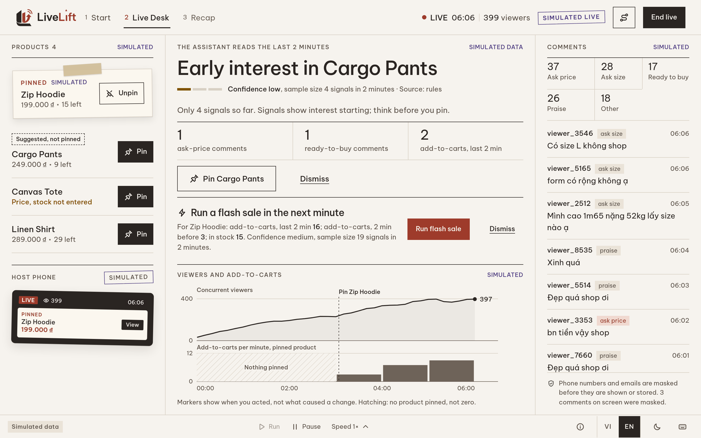
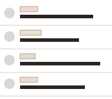
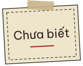
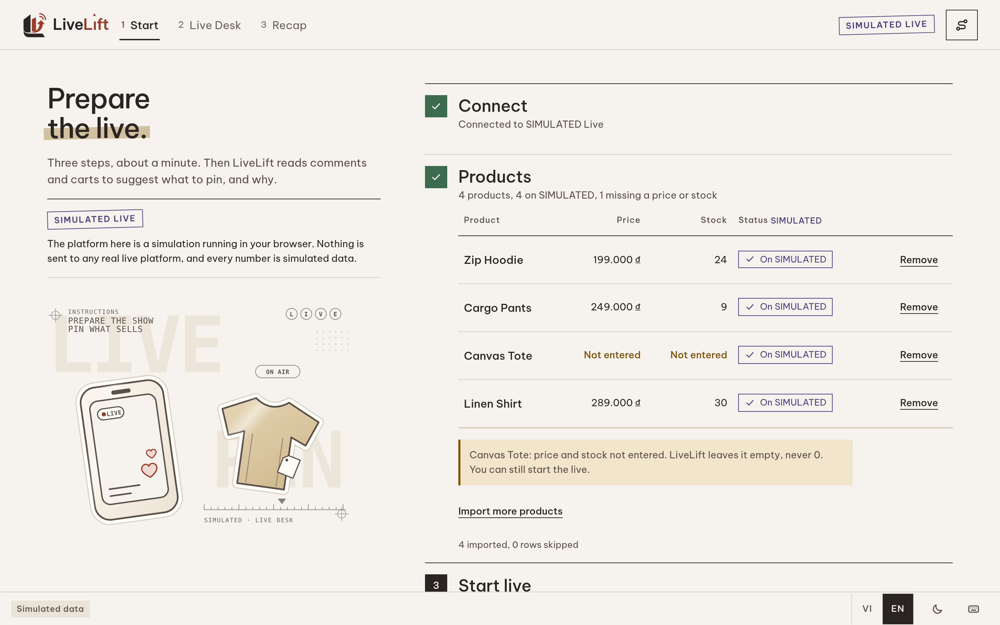
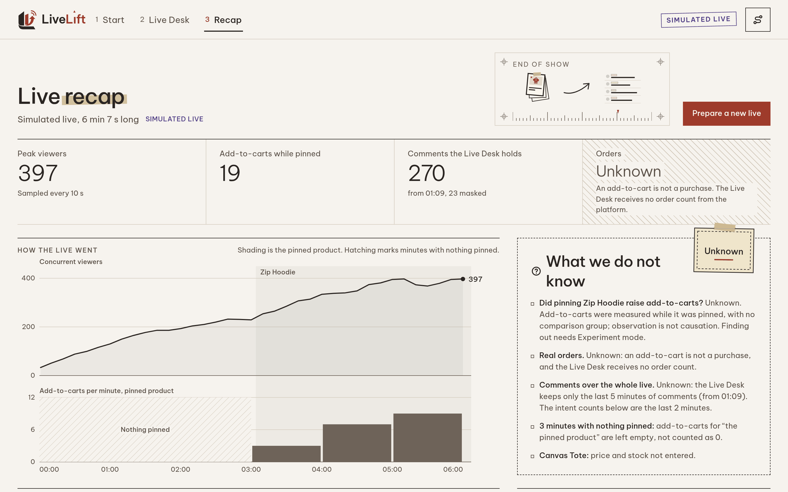
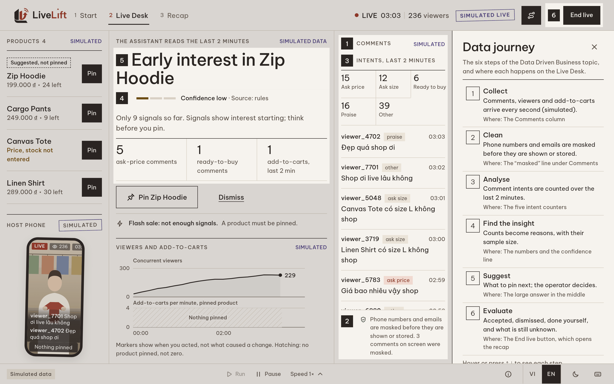
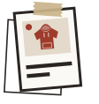
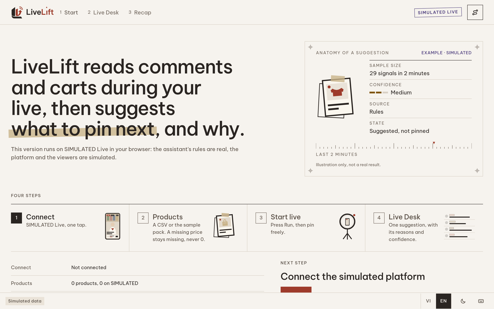
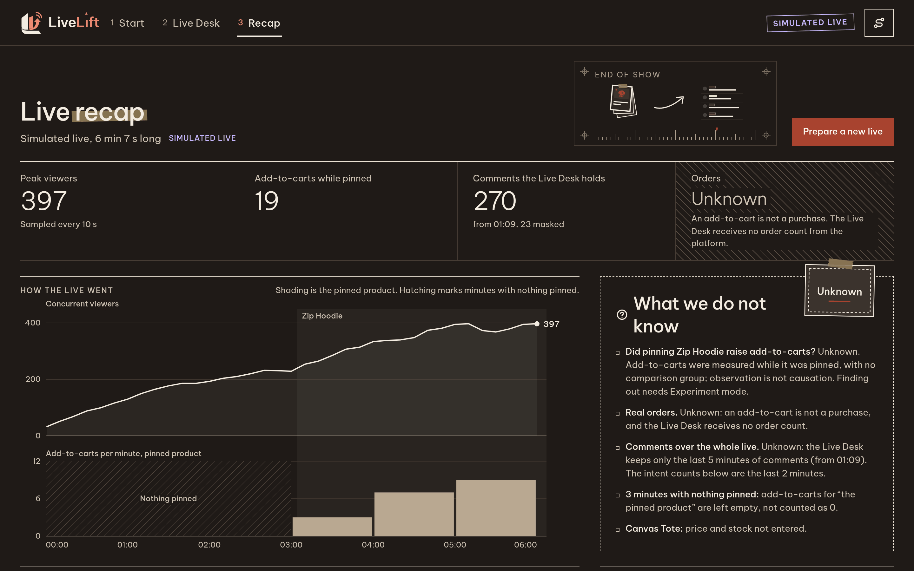

<div align="center">

<picture>
  <source media="(prefers-color-scheme: dark)" srcset="docs/brand/logo/logo-lockup-dark.svg">
  
</picture>

### Reads the comments and carts of a live, then suggests what to pin, and why.

[](LICENSE)
[](next/package.json)
[](next/package.json)
[](#what-is-real-and-what-is-simulated)

[How it works](#how-it-works) · [Run it](#run-it) · [The assistant](#the-assistant) · [Evidence model](#the-evidence-model) · [Design](#design) · [Quality](#quality)

</div>

<picture>
  <source media="(prefers-color-scheme: dark)" srcset="docs/img/readme/livedesk/desk-dark.png">
  
</picture>

<p align="center"><sub>The Live Desk, six minutes into a SIMULATED live: one large answer in the middle, its sample size and confidence under it, and the operator's one-tap choice. Every number on it comes from a seeded generator.</sub></p>

## Why LiveLift

During a livestream sale the signals arrive faster than anyone can read them: comments asking the price, asking the size, saying *chốt đơn*, add-to-carts ticking up on one product while another is pinned. The host decides what to show next from memory and gut feeling, and nobody writes down why.

LiveLift sits beside the live and does the reading. It counts what the room is asking for, says in one sentence what the signals suggest and how sure it can be, and leaves the decision to the operator. After the live, it shows what was suggested, what was done, and what is still unknown.

## How it works

<table>
  <tr>
    <td align="center" width="25%"><picture><source media="(prefers-color-scheme: dark)" srcset="docs/brand/assets/dark/dien-thoai-livestream.svg"></picture><br><b>1 · Connect</b></td>
    <td align="center" width="25%"><picture><source media="(prefers-color-scheme: dark)" srcset="docs/brand/assets/dark/chong-the.svg"></picture><br><b>2 · Products</b></td>
    <td align="center" width="25%"><picture><source media="(prefers-color-scheme: dark)" srcset="docs/brand/assets/dark/binh-luan-chip.svg"></picture><br><b>3 · Live Desk</b></td>
    <td align="center" width="25%"><picture><source media="(prefers-color-scheme: dark)" srcset="docs/brand/assets/dark/ghi-chu-chua-biet.svg"></picture><br><b>4 · Recap</b></td>
  </tr>
  <tr>
    <td valign="top">Connect to SIMULATED Live in one tap.</td>
    <td valign="top">Paste CSV or TSV, or use the sample pack. A missing price stays <i>Not entered</i>, never 0.</td>
    <td valign="top">Comments, viewers and add-to-carts every second. One answer, one tap to pin.</td>
    <td valign="top">What was suggested, accepted, dismissed or done by hand, and what is still unknown.</td>
  </tr>
</table>

| | |
|---|---|
|  |  |
| **Start.** Three steps, about a minute. The imported list scrolls in its own box, so *Start live* stays in reach. | **Recap.** Measured numbers first, unknown orders last. Observation is not causation, so “did the pin raise add-to-carts?” stays *Unknown*. |

### The Live Desk, in three columns

- **Products.** One-tap *Pin* and *Unpin*. The pinned product becomes a card under kraft tape; a suggestion the operator has not taken is drawn in ink dashes, never in red.
- **The answer.** The assistant reads the last two minutes and writes one sentence (*“Early interest in Cargo Pants”*), with the counts behind it, the sample size and a confidence that comes from the sample size alone. A thin sample is said to be thin.
- **Comments.** Every comment is sorted by intent (ask price, ask size, ready to buy, praise, other). Phone numbers and emails are masked before they are shown or stored.

The chart marks when the operator pinned or unpinned. Markers show *when*, never *why*; minutes with nothing pinned are hatched, not drawn as zero.

### The data journey



Press <kbd>J</kbd> on the desk and six numbered badges appear on the screen, one for each step of the *Data Driven Business* topic: **collect** (the comment stream), **clean** (masking), **analyse** (intent counts), **find the insight** (counts become reasons with a sample size), **suggest** (the large answer) and **evaluate** (the recap).

## Run it

Requires **Node 22.23.3**, npm and git.

```bash
git clone https://github.com/Towfienes/LiveLift.git
cd LiveLift
(cd next && npm ci)
./start-livelift-demo        # starts the app on http://localhost:3130, checks it and opens the Home
./stop-livelift-demo         # stops it
```

No account, server or API key is needed. The live is kept in your browser. For development: `cd next && npm run dev`.

| Key | Does |
|---|---|
| <kbd>Space</kbd> | Run or pause the simulation clock |
| <kbd>1</kbd> <kbd>2</kbd> <kbd>3</kbd> | Start, Live Desk, Recap |
| <kbd>J</kbd> | Data journey |
| <kbd>T</kbd> | Light or warm-dark theme |
| <kbd>P</kbd> | Presenter mode for a projector |
| <kbd>?</kbd> | All keys |

The screens speak Vietnamese by default; switch to English in the bottom bar. A 90-second presenter script is in [docs/livedesk/README.md](docs/livedesk/README.md).

## The assistant

The assistant is a set of deterministic rules, and it is always available, with no key.

- **What to pin next.** Among the products not showing, the one with the most buying interest. *Ready to buy* counts twice; asking the price or the size and adding to cart count once. It needs at least three signals.
- **A flash sale.** For the product showing: at least four add-to-carts in the last two minutes, more than in the two minutes before, and entered stock of at least ten. Unknown stock is never treated as healthy.
- **Confidence comes from the sample size alone:** low under 10 signals, medium under 25, high above. No probabilities, no percentages. Headlines say what the signals *suggest*, never what caused what.
- **The operator decides.** A suggestion moves from *proposed* to *accepted* or *dismissed* only by the operator's tap, and becomes *performed* only when the platform, as read back, shows it done.

An optional AI model can re-rank the rule candidates and reword their headlines, but never change their numbers. Its replies are validated, and any failure falls back to the rules. It runs on the server and is not yet wired to the screens, so today the desk always says *Rules only*. Details: [docs/livedesk/ARCHITECTURE.md](docs/livedesk/ARCHITECTURE.md).

## What is real and what is simulated

| | |
|---|---|
| **SIMULATED** | The platform is *SIMULATED Live*, a live-commerce platform simulated in the browser. Nothing is sent to or received from any real live platform. |
| **Simulated data** | Viewers, comments and add-to-carts come from a seeded generator. Its assumptions are listed under *About this data* on the Live Desk. |
| **Really running** | The assistant's rules, phone-number masking, comment intent classification and every button you press. They run for real, on simulated data. |
| **Not yet** | A real platform link, a database and Experiment mode. |

Every surface that shows simulated state says SIMULATED. The simulated platform copies one published API reference, Shopee's `update_show_item`; every other call is shape inferred and labelled so: [docs/platform/SHOPEE-LIVE-SIMULATION.md](docs/platform/SHOPEE-LIVE-SIMULATION.md).

## The evidence model

Every screen, test and assistant rule keeps these apart:

| Distinction | Why it matters |
|---|---|
| `missing ≠ zero` · `unknown ≠ failed` · `planned ≠ actual` | A gap in the data is not a result. A price not entered is not a free product. |
| `recommendation ≠ acceptance ≠ performed` | It shows which advice was taken and what was actually done, so no outcome is credited to advice nobody acted on. |
| `operator reported ≠ provider observed ≠ platform confirmed` · `REAL ≠ SIMULATED` | Each source is trusted for what it is, and simulated data never becomes real learning. |
| `observation ≠ causation` | The recap can show that add-to-carts rose while a product was pinned; it never claims the pin caused it. |

They are tested invariants: a missing value rendered as zero, a suggestion counted as performed too early, or a simulated surface without its label each fail an automated check.

## Design

<picture><source media="(prefers-color-scheme: dark)" srcset="docs/brand/assets/dark/the-san-pham-ao-hoodie.svg"></picture>

**Calm Studio.** Paper `#F6F3EE`, ink `#2A2522`, brick `#9E3B2B` only for LIVE and the one primary action, kraft tape for what is pinned, violet for SIMULATED. Be Vietnam Pro, self-hosted. Light by default, with a warm dark theme.

Page titles use one weight, with one phrase on kraft tape. Empty space on wide screens carries quiet spec-sheet drawings (registration marks, tick rulers, die-cut stickers) that never contain a number, so nothing decorative reads as data. Brand files: [docs/brand](docs/brand/logo/README.md). Design decisions: [docs/livedesk/DESIGN-NOTES.md](docs/livedesk/DESIGN-NOTES.md).

<br clear="right">

<table>
  <tr>
    <td width="50%"></td>
    <td width="50%"></td>
  </tr>
  <tr>
    <td align="center"><sub>Home</sub></td>
    <td align="center"><sub>Recap, warm dark theme</sub></td>
  </tr>
</table>

## Quality

From `next/`, on Node 22.23.3:

```bash
npm run typecheck && npm run lint && npm test && npm run build
```

| Gate | Result (10 October 2026) |
|---|---|
| Unit and component tests (Vitest, 88 files) | **1,419 passed**, 57 conditional live-server tests skipped |
| Typecheck, lint, production build, `npm ci` audit | Pass, 0 vulnerabilities |
| Live Desk browser acceptance: 4 viewports × 2 runs, axe-core WCAG A/AA | **PASS**, 104 audited states, 0 violations, same run fingerprint every time |

The browser harness drives a production build over local HTTPS in Chromium: `node acceptance/livedesk-browser.mjs` (Playwright and axe-core are installed outside the product's dependencies).

## Limitations

- **Simulated, end to end.** No real live platform is connected and every number is generated. Nothing here is a field result.
- **Rules only on screen.** The AI refinement exists on the server but is not wired to the desk yet.
- **One browser.** A live is kept in the browser's storage; there is no database and no shared room yet.
- **Accessibility evidence is automated.** axe-core and keyboard checks pass; manual screen-reader testing has not been done.

## Team and lineage

LiveLift is built by Ngô Bình Minh, Lê Xuân Khánh and Ngô Lâm Tiến for the AISC 2026 *Data Driven Business* track and the Vietnamese National Youth Creativity Contest on AI 2026. It grew from the original research project [bminhnemhoi/AISC2026_LIVEFIT](https://github.com/bminhnemhoi/AISC2026_LIVEFIT), which asked whether an in-stream action such as pinning a product causes more clicks, using switchback experiments and a preregistered analysis ([PREREGISTRATION.md](PREREGISTRATION.md)). That question is why LiveLift is careful never to call an observation a cause. Changes: [CHANGELOG.md](CHANGELOG.md).

Development used AI coding assistance (Claude Code). Assisted commits carry a co-author trailer.

<sub>Tiếng Việt: LiveLift đọc bình luận và giỏ hàng trong buổi live, rồi gợi ý nên ghim gì, và vì sao. Giao diện mặc định là tiếng Việt; kịch bản trình bày 90 giây nằm trong [docs/livedesk/README.md](docs/livedesk/README.md).</sub>

## License

LiveLift is free software under the [GNU Affero General Public License v3.0](LICENSE) (`AGPL-3.0-only`), the license of the original project. If you run a modified version as a network service, the AGPL requires you to offer its users the corresponding source code. To cite the original research software, see [CITATION.cff](CITATION.cff).
