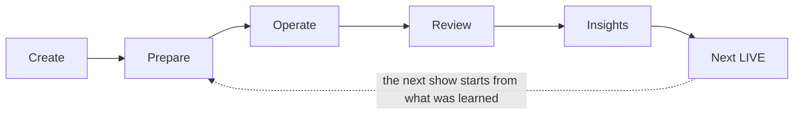
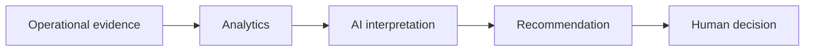
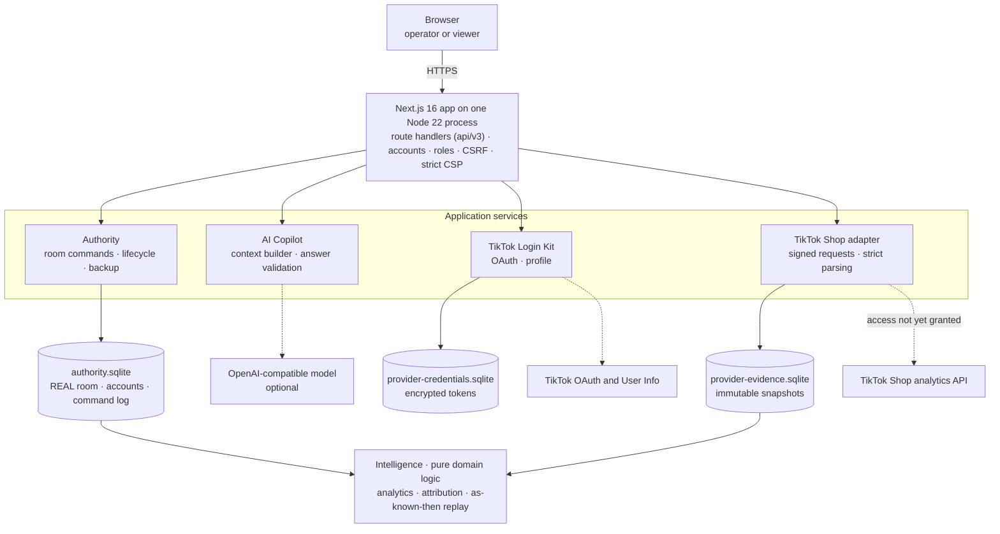

# LiveLift

**Turning livestream data into better business decisions.**

LiveLift is a data-driven operations and intelligence platform for livestream commerce. It helps an operator plan a show, stay on pace during the LIVE, capture evidence, review what actually happened, and turn those findings into a better next LIVE.

[](LICENSE)
[](next/package.json)
[](next/package.json)

[Quick start](#quick-start) · [Demo](#demo) · [Architecture](#architecture) · [Evidence model](#the-evidence-model) · [Documentation](docs/README.md)


<sub>Operate, mid-show. The host has asked for six more minutes on Zip Hoodie, which would push the 20:12 Flash Sale one minute late. The desk explains the conflict and offers the recovery that keeps the commitment; nothing is applied until the operator chooses it. This is the shipped SIMULATED rehearsal, captured from the certified build.</sub>

## Why LiveLift exists

A livestream produces a lot of observations: the plan, the clock, what the host said, what the operator saw in the comments, what the platform reports the next day. Decisions about the next show are still mostly made from memory and intuition, and the reasoning behind them is rarely written down.

LiveLift keeps those observations apart and on the record:

- what was **planned**, and what **actually happened**;
- what the **operator reported** during the LIVE;
- what an external **provider observed** afterwards;
- what the **AI inferred**, and what the operator **actually accepted**.

Each of these is a different kind of evidence. Keeping them separate is what lets a team learn from a show without fooling itself, and LiveLift turns the result into the plan for the next one. In short, it moves livestream operations from intuition-driven to evidence-driven.

LiveLift is not a TikTok client, a chatbot or a metrics dashboard. It sits beside the platform as an operational decision-support system for the person running the show.

## The operating loop



| Stage | What the operator does | What LiveLift keeps |
|---|---|---|
| **Create** | Start from blank, a template, a sample pack or a previous show | REAL or SIMULATED identity, fixed for the life of the show |
| **Prepare** | Build the Run of Show: timed segments, hard anchors, products, cues | A baseline plan that is never rewritten |
| **Operate** | Run the show from one desk: NOW, NEXT, WHY, ACTION | An append-only record of starts, ends, decisions and reports |
| **Review** | Compare plan with record, in two explicit perspectives | *As known then* and *With later evidence*, never merged |
| **Insights** | Look across ended shows for overruns and repeated deviations | Derived views only; missing data stays missing |
| **Next LIVE** | Tick the proposed changes worth keeping | A new plan that records exactly which changes were chosen |

## Operate: NOW, NEXT, WHY, ACTION

The desk is built to answer four questions in a glance, while the host is talking:

- **NOW**: the running segment, time elapsed against its target and declared minimum.
- **NEXT**: what follows, when it will actually start, and whether a **hard anchor** (a committed time such as a 20:12 flash sale) is at risk.
- **WHY**: the schedule arithmetic in one sentence, e.g. *"Zip Hoodie is projected to end 20:13:00 (host estimate). It would start 20:13:00, 1:00 late."*
- **ACTION**: recovery options computed from the plan: end by the anchor, close now, shorten or skip later segments. Options that break a declared minimum or required coverage are labelled as exceptions. Moving an anchor is a separate, explicit commitment change, never a side effect.

Below it, the **Run of Show** tracks actual against planned time and projected drift. **Quick Cues** record one-tap operator observations (*price questions rising*, *CTA delivered*, *product pin changed*, *audience reaction spike*, *unexpected issue*). Each one is stored as an ordinary note labelled *Operator reported*: it is the operator's word, not platform confirmation, and it changes no show state.

REAL shows run on a server-authoritative clock in a shared room, recorded under the signed-in operator. SIMULATED rehearsals run the same engine on a virtual clock in the browser. The AI Copilot sits in a tab beside the history. It can recommend; it cannot apply. **The operator remains authoritative.**

## Review: as known then, and with later evidence

Review compares the baseline plan with what was recorded: segment by segment, cue by cue, decision by decision. Its central rule:

> Later evidence must never appear as if the operator knew it during the LIVE.

Review therefore has two explicit perspectives.

**As known then** reconstructs exactly what the operator had: the plan, the records written up to the end of the LIVE, and what was reported, in order. Each decision shows what the plan expected and what was actually running at that moment, which answers *"why did we decide that, then?"* Notes and corrections added after the show are counted, but not replayed into the timeline.


**With later evidence** adds what a provider observed after the LIVE, aligned to the segments the operator recorded. It opens with one sentence, *"This data was not available to the operator during the LIVE."*, followed by provenance: evidence tier, source, fetch time and snapshot.


<sub>The provider data in this screenshot is a labelled fixture generated from the rehearsal's recorded times. It is not TikTok data, and LiveLift never shows fixture evidence for a REAL show.</sub>

Every record carries its provenance, and the tiers are never promoted into each other:

| Tier | Who says so | Example |
|---|---|---|
| Operator reported | The operator, in LiveLift | "Pin Cargo Pants reported performed at 20:15:20" |
| Provider observed | A provider API, fetched after the LIVE | Product clicks per minute from TikTok Shop analytics |
| Platform confirmed | The platform confirming the action itself | No current integration establishes this, so verification stays *Unknown* |

## LIVE Intelligence

LIVE Intelligence is the provider-evidence layer behind *With later evidence* and the Insights page:

- **Immutable snapshots.** Each refresh stores a new snapshot with its own ID and fetch time. Earlier snapshots are never edited, and a failed refresh never turns an old snapshot into a current one.
- **Minute-level evidence**: clicks, orders, GMV, viewers, impressions and comments per provider minute.
- **Segment attribution.** A minute lying fully inside a recorded segment is attributed to it. A minute that straddles a boundary is shown, but **assigned to neither segment and never prorated**. A segment that never ran gets no invented window.
- **Product performance** through explicit product mappings only, never by guessing from names. Money is kept as exact decimals with its currency, and mixed currencies are never summed.
- **Provider limitations as data.** A 13-entry capability matrix states what the provider can and cannot supply. Raw comment text and pin control are *unsupported*, and missing metrics stay *Not recorded* rather than zero.
- **AI Review with citations.** Quantitative AI statements must cite the exact provider fact (source, tier, fetch time). Causal and platform-confirmed claims are rejected.

The product's own language shows the difference between observation and causation:

> **Observation:** "Provider-observed product clicks per minute were higher during *Zip Hoodie* (17 per minute across 9 full minutes) than during the previous segment *Opening* (11 per minute across 3)."
>
> **Not a claim LiveLift makes:** "Zip Hoodie caused higher sales."

## AI Copilot

AI in LiveLift is the interpretation layer, not the source of truth.



- The model receives one typed document per request: facts LiveLift composed from its own records, each labelled *recorded*, *computed*, *operator reported*, *not established* or *simulated*, plus the recovery options and Next LIVE changes that LiveLift's own logic already computed.
- **It can only recommend from those options.** It cannot start, skip, apply or accept anything. Advice is shown as *Recommended · not applied*, and Next LIVE proposals stay unticked until the operator ticks them.
- Answers are validated before display. An answer that invents evidence, claims causation or claims platform confirmation is refused and shown as *Invalid response*.
- The Operate Copilot never sees later provider evidence, so it cannot leak hindsight into a live decision.
- It is optional and off by default. Any OpenAI-compatible endpoint works. Keys stay server-side, and LiveLift works fully without AI.

Recommendation is not acceptance. Details: [docs/ai/COPILOT.md](docs/ai/COPILOT.md).

## The evidence model

Every screen, API contract and AI prompt in LiveLift enforces the same distinctions. Each group of them protects a different step in a data-driven decision:

| Distinction | Why it matters |
|---|---|
| `missing ≠ zero` · `unknown ≠ failed` · `planned ≠ actual` | A gap in the data is not a result. Treating it as one turns a dropped reading into a bad segment. |
| `recommendation ≠ acceptance ≠ attempt ≠ performed` | It lets the team see which advice was taken and what was actually done, so outcomes are not credited to advice nobody acted on. |
| `operator reported ≠ provider observed ≠ platform confirmed` · `REAL ≠ SIMULATED` | Each source is trusted for what it is. Rehearsal data never becomes real learning. |
| `observation ≠ causation` · `later evidence ≠ evidence known during the LIVE` | Post-show data can explain a show, but it cannot be used to judge a decision made without it. |

These are tested invariants, not style guidance: a zero render, a missing render, a perspective switch or a fixture leaking into REAL each has an automated check.

## TikTok integration

| Status | What it covers |
|---|---|
| **Working with a real account** | TikTok Login Kit OAuth. A real TikTok identity has been connected; the profile (`user.info.basic`) is shown as *provider observed*. Tokens are AES-256-GCM encrypted server-side and kept out of authority backups. |
| **Implemented** | TikTok Shop provider adapter with request signing, strict response parsing, immutable evidence persistence, LIVE segment attribution and product performance. |
| **Blocked externally** | Real TikTok Shop analytics. The current seller account does not have TikTok Seller Developer / analytics API entitlement, so no real Shop analytics have been fetched. |
| **Simulated** | All provider analytics in demos and certification are fixture data, labelled *SIMULATED* / *Fixture provider evidence* wherever they appear. |

LiveLift does not start, read or control a TikTok LIVE. It does not read raw LIVE comments, and it does not pin or unpin products through any TikTok API. The operator acts in TikTok and reports it here. Details: [docs/tiktok/](docs/tiktok/README.md) and [LIVE Intelligence implementation](docs/tiktok/LIVE-INTELLIGENCE-IMPLEMENTATION.md).

## Architecture



- **One source of truth.** REAL show state lives in one SQLite authority database, changed only through validated room commands. Provider credentials and provider evidence sit in **separate** SQLite files, so restoring a room backup can never roll back tokens or rewrite evidence.
- **Shared, pure domain logic.** Forecasting, recovery, analytics and attribution are side-effect-free TypeScript used by both server and browser, which is why a SIMULATED rehearsal behaves exactly like a REAL show.
- **Deployment.** One Linux host, one Node process, one SQLite file and a Caddy HTTPS edge (`docker-compose.v3.yml`). An `ops` CLI handles init, users, backup, restore and migration: [runbook](docs/phase3/platform/runbook.md).

## Demo

The shipped rehearsal *Fall collection rehearsal* needs no account, server or API key:

1. **Create**: see the four starting points and the REAL / SIMULATED switch.
2. **Prepare**: open the rehearsal; note the hard anchor on the 20:12 Flash Sale.
3. **Operate**: start it and press **Apply step** twice. Zip Hoodie overruns; NOW / NEXT / WHY show the anchor at risk.
4. **Recovery**: apply *End Zip Hoodie by 20:12*. Add a **Quick Cue** or a note.
5. **AI recommendation**: open the *AI Copilot* tab. LiveLift's own facts are labelled *Product logic · not AI*; with a configured model, the AI's interpretation and recommendation appear as separate, labelled layers.
6. **Finish** the scripted steps, then open **Review** in *As known then*.
7. Switch to **With later evidence** to see clearly labelled fixture provider evidence and segment attribution.
8. **Insights**, then **Next LIVE**: tick one proposed change and create the next show.
9. **Integrations**: what is connected, what is fixture, and what TikTok does not offer.

Every rehearsal record is badged SIMULATED. Presenter script and recovery tips: [docs/competition/v3-demo/README.md](docs/competition/v3-demo/README.md).

## Quick start

Requires **Node 22.23.3** (the certified version; `package.json` accepts `>=22.16 <23 || >=24`), npm and git.

```bash
git clone https://github.com/Towfienes/LiveLift.git
cd LiveLift
(cd next && npm ci)
./start-livelift-demo        # SIMULATED rehearsal server on http://localhost:3130
```

The launcher runs an isolated rehearsal server with REAL authority disabled. A banner saying the sign-in service cannot be reached is expected: rehearsals still work. `./check-livelift-demo` prints a health report; Ctrl+C or `./stop-livelift-demo` stops it. On Windows, use `node scripts/competition/launcher.mjs start`.

To run REAL shows with accounts, roles and the shared room, deploy with HTTPS following the [platform runbook](docs/phase3/platform/runbook.md). Optional AI and TikTok settings are documented in [COPILOT.md](docs/ai/COPILOT.md) and [SANDBOX-SETUP.md](docs/tiktok/SANDBOX-SETUP.md). No secrets are committed; `next/.env.production.example` holds placeholders only.

## Testing and certification

From `next/`:

```bash
npm run typecheck && npm run lint && npm test && npm run build
npm audit --omit=dev
```

Results for the certified build (commit `419c07d`), re-run on Node 22.23.3 on 8 October 2026:

| Gate | Result |
|---|---|
| Unit and component tests (Vitest, 62 files) | **1,047 passed**, 57 conditional live-server tests skipped |
| Typecheck, lint, production build | Pass |
| Production dependency audit | 0 vulnerabilities |
| Final competition harness: full journey, 2 configurations × 3 viewports | **234 PASS / 0 FAIL** |
| LIVE Intelligence browser acceptance, including axe-core WCAG A/AA scans | **72 / 72**, 0 accessibility violations on audited states |

The browser harnesses drive a real production build over local HTTPS in Chromium, with synthetic TikTok and AI upstreams. They need Playwright and Chromium installed outside the product's dependencies; see [FINAL-CERTIFICATION.md](docs/competition/FINAL-CERTIFICATION.md) and the [V7 acceptance report](docs/tiktok/V7-INTEGRATION-ACCEPTANCE.md).

## Current limitations

- **No real TikTok Shop analytics yet.** Access is blocked by seller-account entitlement (see above). Everything shown as provider analytics is fixture data.
- **Provider limits.** No raw comment text, no pin control and no realtime product-click stream. Creator audience concurrency requires restricted access that has not been granted or certified.
- **AI quality is not certified.** Certification uses a deterministic AI fixture to test LiveLift's boundaries, not a model's judgement. Answer quality depends on the model you configure.
- **Single room, single process.** One Node process and one SQLite authority per deployment, by design. It does not scale horizontally.
- **No field results yet.** A validation protocol for real operators is written ([docs/validation/v3](docs/validation/v3/00_VALIDATION_PROTOCOL.md)); no field results are published.
- **Accessibility evidence is automated.** axe-core and keyboard checks pass; manual screen-reader testing has not been performed.

## Project lineage

LiveLift is a derivative of the original **LiveLift** project, [bminhnemhoi/AISC2026_LIVEFIT](https://github.com/bminhnemhoi/AISC2026_LIVEFIT), built by Ngô Bình Minh, Lê Xuân Khánh and Ngô Lâm Tiến for the AISC 2026 *Data Driven Business* track and the Vietnamese National Youth Creativity Contest on AI 2026.

The original project asked a narrower, rigorous question: *did an in-stream action, such as pinning a product, actually cause more clicks?* It answered with switchback experiments (randomising time blocks instead of viewers), a preregistered analysis plan, and randomization inference validated on a calibrated simulator, together with a FastAPI control desk and Vietnamese comment-privacy filtering.

The current product grew that foundation into an end-to-end operations and intelligence system. It adds:

- an authoritative LIVE room with a recorded command history;
- application accounts and operator / viewer roles;
- persistence, backup, restore and recovery;
- production deployment and operations tooling;
- the AI Copilot;
- operational analytics and the Next LIVE feedback loop;
- real TikTok Login Kit integration and the provider-evidence architecture;
- *As known then* / *With later evidence* and segment attribution;
- a responsive interface certified for the competition.

The original Python research stack, with its deeper switchback and causal-analysis machinery, remains in this repository (`src/`, `tests/`, [PREREGISTRATION.md](PREREGISTRATION.md)) and is documented separately. It is not wired into the current Next.js product. See the [documentation index](docs/README.md), the [original README (Vietnamese)](docs/legacy/ORIGIN-README.vi.md) and the [CHANGELOG](CHANGELOG.md).

Development used AI coding assistance (Claude Code). Assisted commits carry a co-author trailer, continuing the disclosure practice of the original project.

<sub>Tiếng Việt: tài liệu của dự án gốc (thí nghiệm switchback, hồ sơ dự thi) vẫn được giữ nguyên trong kho; xem [README gốc](docs/legacy/ORIGIN-README.vi.md) và [mục lục tài liệu](docs/README.md).</sub>

## License

LiveLift is free software under the [GNU Affero General Public License v3.0](LICENSE) (`AGPL-3.0-only`), the license of the original project, which this derivative keeps. If you run a modified version as a network service, the AGPL requires you to offer its users the corresponding source code. To cite the original research software, see [CITATION.cff](CITATION.cff).
