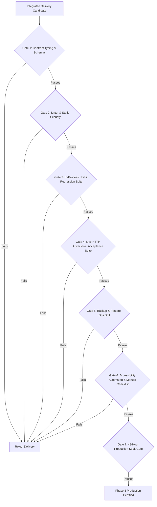

# Phase 3 Integration Audit Plan

This document establishes the executable protocol for independently auditing and certifying the LiveLift V3 Phase 3 implementation when Platform and UI lanes deliver their worktrees.

---

## 1. Audit Prerequisites & Environment Configuration

Prior to initiating live verification against an integrated delivery, configure the following environment:

| Variable | Description / Example Value |
|---|---|
| `LIVELIFT_TEST_SERVER_URL` | `http://localhost:3130` (or `https://staging.livelift.local`) |
| `LIVELIFT_APP_ORIGIN` | `https://staging.livelift.local` |
| `LIVELIFT_WORKSPACE_ID` | `00000000-0000-4000-8000-000000000001` |
| `LIVELIFT_ROOM_ID` | `room-aud-01` |
| `LIVELIFT_GENERATION` | `11111111-1111-4111-8111-111111111111` |
| `LIVELIFT_DB_PATH` | `/var/lib/livelift/authority.sqlite` |
| `LIVELIFT_BACKUP_DIR` | `/var/backups/livelift` |
| `LIVELIFT_OPERATOR_USERNAME` | `operator` |
| `LIVELIFT_OPERATOR_PASSWORD_FILE` | Protected operator password file (live soak) |
| `LIVELIFT_VIEWER_USERNAME` | `viewer` |
| `LIVELIFT_VIEWER_PASSWORD_FILE` | Protected viewer password file (live soak) |

The live soak requires explicit deployment identity and protected credential files; it
never uses the acceptance client's fixture credentials or password environment fallback.
`LIVELIFT_GENERATION` is optional for the soak: login discovers and pins the current
generation. Supplying it additionally verifies that login matches the expected generation.

---

## 2. Lane Delivery Handoff Verification Gates

Every candidate branch or merge submission must pass through the sequential gates below:



### Gate 1: Contract Typing & Schemas (PASS NOW)
- **Command:** `npm run typecheck` (in `next/`)
- **Pass Criteria:** 0 TypeScript compilation errors. Frozen contracts in `contracts/production.ts` and `contracts/authority.ts` must remain completely unmodified.

### Gate 2: Code Quality & Static Linter (PASS NOW)
- **Command:** `npm run lint` (in `next/`)
- **Pass Criteria:** 0 ESLint errors and 0 warnings.

### Gate 3: In-Process Unit, Fixtures & Regression Suite (PASS NOW)
- **Command:** `npm test` (in `next/`)
- **Pass Criteria:** All 28 test files and 340 tests pass (55 live tests skipped gracefully when live server is not running).

### Gate 4: Live HTTP Adversarial Acceptance Suite (INTEGRATION REQUIRED)
- **Command:**
  ```bash
  export LIVELIFT_TEST_SERVER_URL=http://localhost:3130
  export LIVELIFT_APP_ORIGIN=http://localhost:3130
  npm test
  ```
- **Pass Criteria:** All 395 tests pass with 0 failures and 0 skipped. Verifies P3-AUTH, P3-ISOLATION, P3-AUTHZ, P3-CSRF, P3-STORAGE, P3-SECURITY, P3-OBSERVABILITY, and P3-DATA.

### Gate 5: Backup & Restore Ops Drill (INTEGRATION REQUIRED)
- **Protocol:**
  1. Trigger verified backup via CLI (`ops backup`).
  2. Confirm manifest fields, checksum SHA-256, and SQLite integrity check.
  3. Modify database or advance room revision.
  4. Perform restore drill via CLI (`ops restore <backup-dir>`).
  5. Confirm:
     - New generation assigned.
     - Login sessions revoked.
     - Restored accounts disabled until admin revalidation.
     - Recovery notice present with correct backup revision.
     - Measured restore duration <= 1 hour (RTO).

### Gate 6: Accessibility Verification
- **Automated:** Execute axe scans once `axe-core` is integrated by Platform lane (`npm run test:a11y`).
- **Manual Evidence Checklist:**
  - [ ] Complete critical flow using only the keyboard (`Tab`, `Shift+Tab`, `Enter`, `Space`, `Escape`).
  - [ ] Dialog focus trap: Tab cannot leave active restore modal; focus returns to trigger on dismissal.
  - [ ] 200% zoom: Layout scales without clipping, overlaps, or horizontal scrollbars.
  - [ ] Screen reader verification: NVDA / VoiceOver correctly announces Login, LIVE start transition, and Restore dialog.
  - [ ] Timer verification: Elapsed segment timers are not spammed to screen reader every second.

### Gate 7: 48-Hour Production Soak Endurance Rehearsal
- **Protocol:**
  ```bash
  # From next/, with the live environment from the platform runbook loaded:
  npm ci
  npm run soak:smoke -- --duration 60s
  npm run soak:48h -- --duration 48h
  ```
- **Entry point:** `acceptance/soak.mjs` compiles `liveSoak.ts` and the existing
  `ProductionClient` with the locked, already-installed TypeScript compiler into a
  temporary directory, runs the CLI, and removes that directory. No `tsx`, experimental
  TypeScript loading, production dependency or product runtime change is required.
- **Live behavior:** explicit operator/viewer login, session checks and explicit
  reauthentication near the absolute 12-hour expiry; full room reads from both roles;
  one new planned REAL draft, then repeated `save_prepare` commands against that draft.
  The runner does not start a show, alter an existing show, restore, or delete data.
- **Fault exercise:** cancel an authenticated read before dispatch, then poll again;
  deliberately discard every fifth command acknowledgement (including the first),
  reconcile through the live receipt endpoint and replay the identical envelope to check
  idempotence. Real transport failures look up the stable command ID before resending.
  Connectivity/429/502/503/504 responses retry for at most five minutes per operation;
  requests time out after ten seconds. Unexpected auth/context/server errors fail closed.
- **Status and backups:** set `LIVELIFT_SOAK_OPS_EXECUTABLE` to a trusted executable wrapper
  for the existing deployment's `ops` CLI. It receives only `status --json` and `backup`.
  Status is checked at the health interval; verified online backup runs at startup and
  hourly. Output is captured and suppressed. Each ops command has a 60-second timeout;
  failure exits nonzero. Without this wrapper, HTTP probes still run, but **backup coverage
  is absent** and must be supplied separately for the full release gate.
- **Output/stop:** bounded JSON startup/progress/final lines; smoke progress every five
  seconds, rehearsal every minute. SIGINT/SIGTERM finishes the current bounded operation,
  prints `STOPPED`, and exits 130/143. An interrupted run cannot certify the 48-hour gate.
- **Pass Criteria:**
  - A completed 48-hour run emits final `PASS` and exits 0; a short override is only smoke evidence.
  - Both authenticated roles participate, at least one real mutation commits, and every
    submitted logical intent has a durable committed or stale-revision rejection receipt.
  - Zero revision regression, same-revision snapshot divergence, generation change,
    REAL/SIMULATED contamination, history rewrite, lost session or duplicate commit.
  - All injected lost acknowledgements reconcile; duplicate replay returns the same receipt.
  - Health/readiness remain valid, temporary failures recover, and periodic ops checks pass.
- **Certification:** see [LIVE_SOAK_CERTIFICATION.md](LIVE_SOAK_CERTIFICATION.md) for real
  staging smoke evidence. The executable rehearsal entry point is certified using a short
  duration override; the complete 48-hour endurance gate remains pending.

---

## 3. Step-by-Step Executable Audit Runbook

### Step 3.1: Initialize Clean Deployment
```bash
# 1. Clean slate
rm -f /tmp/livelift-prod-audit.sqlite /tmp/.livelift-*.json
mkdir -p /tmp/backups

# 2. Run explicit initialization via ops CLI
./ops init --db /tmp/livelift-prod-audit.sqlite --workspace 00000000-0000-4000-8000-000000000001 --room room-aud-01

# 3. Add operator and viewer accounts
./ops user add --username operator --name "Lead Operator" --role operator --password-file /tmp/op_pass.txt
./ops user add --username viewer --name "Guest Viewer" --role viewer --password-file /tmp/vw_pass.txt
```

### Step 3.2: Verify Startup & Probe Semantics
```bash
# Start server in production mode
npm run dev -- -p 3130 &
SERVER_PID=$!
sleep 2

# Probe liveness (healthz)
curl -s http://localhost:3130/api/healthz
# Expected: HTTP 200 {"status":"ok"}

# Probe readiness (readyz)
curl -s http://localhost:3130/api/readyz
# Expected: HTTP 200 {"status":"ok"}
```

### Step 3.3: Adversarial Authentication & Cookie Inspection
```bash
# 1. Login as operator
curl -i -s -X POST http://localhost:3130/api/v3/auth/login \
  -H "Content-Type: application/json" \
  -H "X-LiveLift-Request: 1" \
  -H "Origin: http://localhost:3130" \
  -d '{"username":"operator","password":"OperatorPassword123!"}'

# Verify response headers:
# - Set-Cookie contains __Host-livelift_session
# - Cookie attributes include: Secure, HttpOnly, SameSite=Strict, Path=/
# - No Domain attribute
```

### Step 3.4: Adversarial CSRF & Context Probes
```bash
# Missing X-LiveLift-Request -> 403 csrf_failed
curl -s -o /dev/null -w "%{http_code}\n" -X POST http://localhost:3130/api/v3/room/commands \
  -H "Content-Type: application/json" \
  -H "Origin: http://localhost:3130" \
  -H "Cookie: __Host-livelift_session=..." \
  -d '{}'
# Expected: 403

# Wrong Origin -> 403 csrf_failed
curl -s -o /dev/null -w "%{http_code}\n" -X POST http://localhost:3130/api/v3/room/commands \
  -H "Content-Type: application/json" \
  -H "Origin: https://attacker.com" \
  -H "X-LiveLift-Request: 1" \
  -H "Cookie: __Host-livelift_session=..." \
  -d '{}'
# Expected: 403

# Valid Logout -> 200 (requires body: {})
curl -s -o /dev/null -w "%{http_code}\n" -X POST http://localhost:3130/api/v3/auth/logout \
  -H "Content-Type: application/json" \
  -H "Origin: http://localhost:3130" \
  -H "X-LiveLift-Request: 1" \
  -H "Cookie: __Host-livelift_session=..." \
  -d '{}'
# Expected: 200

# Supported Wrong Room Query Target -> 404 not_found
curl -s -o /dev/null -w "%{http_code}\n" -X GET "http://localhost:3130/api/v3/room?roomId=room-unconfigured-foreign" \
  -H "Cookie: __Host-livelift_session=..." \
  -H "X-LiveLift-Workspace: 00000000-0000-4000-8000-000000000001" \
  -H "X-LiveLift-Generation: 11111111-1111-4111-8111-111111111111"
# Expected: 404 (Note: context headers are Workspace and Generation; room enforcement uses query/envelope targets)
```

### Step 3.5: Execute Automated Acceptance Suites
```bash
export LIVELIFT_TEST_SERVER_URL=http://localhost:3130
npm test
```

### Step 3.6: Cleanup
```bash
kill $SERVER_PID
rm -rf /tmp/livelift-prod-audit.sqlite /tmp/backups /tmp/.livelift-*.json
```
